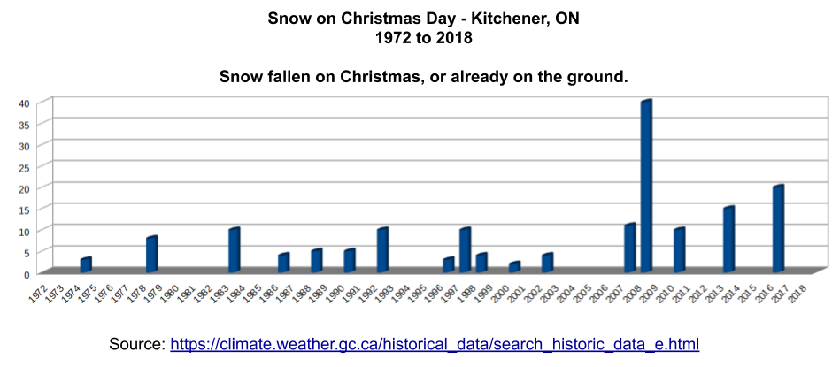

# White Christmas - Snowfall Analysis
## Analysis for 1972 to 2018

### Links

[Source Weather Data](https://climate.weather.gc.ca/historical_data/search_historic_data_stations_e.html?searchType=stnName&timeframe=1&txtStationName=roseville&searchMethod=contains&optLimit=yearRange&StartYear=1840&EndYear=2019&Year=2019&Month=12&Day=18&selRowPerPage=25)

[Blog Post Link](https://www.fortyfour-three.com/?p=1951)

## Instructions

1. Install the Python requests module
	'''pip install requests'''
	* This will give you the ability to download the data for your specific weather station.
2. Run the python code to get a csv of results for your area
3. Use a spreadsheet to create a chart of the results.
